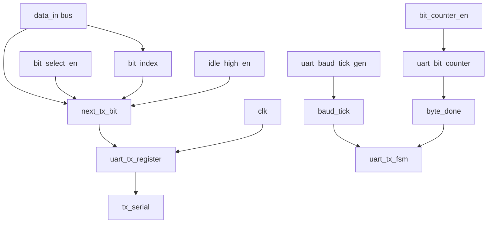
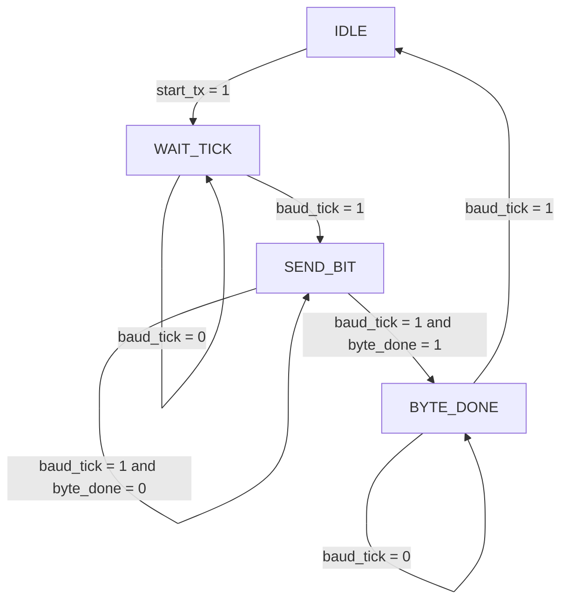
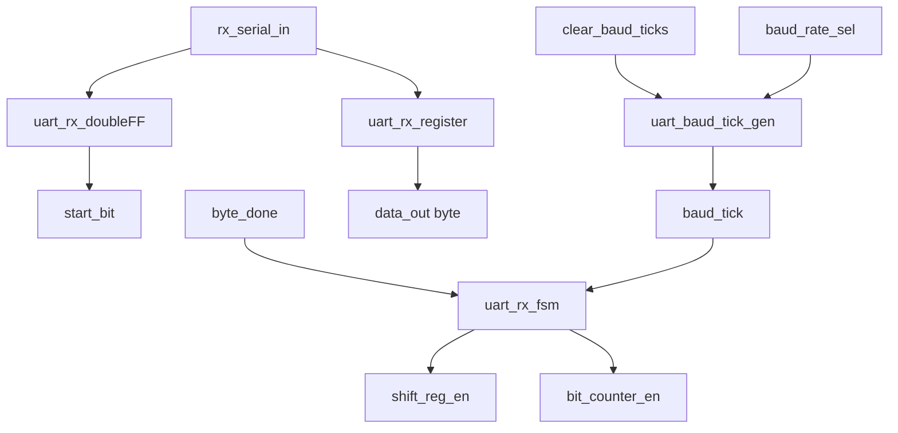
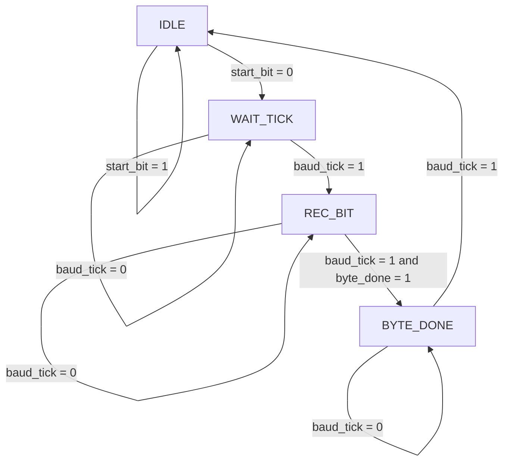

# UART Control and Datapath Core

## Overview
This project documents a UART implementation split into a control path and a datapath. The design currently includes both the transmitter and the receiver path in development, each structured as a separate control FSM and datapath block.

The architecture follows a standard RTL organization:

- Control path: state sequencing and enable/control decisions
- Datapath: data selection, bit shifting, counter updates, and output driving

The current codebase includes the following active modules:

- UART transmitter core
- UART receiver core
- common baud-rate generator and bit counter building blocks

## Project objective
The UART core serializes and deserializes 8-bit data using a clock-derived baud-rate tick. The transmitter drives a serial output and the receiver reconstructs the incoming stream into a byte.

The project is organized so the control logic remains independent from the data movement logic, which makes it easier to understand, test, and extend.

## Module organization
| File | Module name | Description |
| --- | --- | --- |
| uart_tx_top.v | uart_tx_top | Top-level UART transmitter wrapper |
| uart_tx_fsm.v | uart_tx_fsm | TX finite-state machine and output control generation |
| uart_tx_datapath.v | uart_tx_datapath | TX bit selection, counter control, and output serialization |
| uart_tx_register.v | uart_tx_register | UART TX serial register |
| uart_baud_tick_gen.v | uart_baud_tick_gen | Baud-rate tick generator with selectable timing |
| uart_bit_counter.v | uart_bit_counter | Counts bit position inside the byte |
| uart_rx_top.v | uart_rx_top | Top-level UART receiver wrapper |
| uart_rx_fsm.v | uart_rx_fsm | RX finite-state machine for start-bit detection and bit sampling |
| uart_rx_datapath.v | uart_rx_datapath | RX synchronization, shifting, and sampling path |
| uart_rx_register.v | uart_rx_register | RX shift register used to assemble the incoming byte |
| uart_rx_doubleFF.v | uart_rx_doubleFF | Double flip-flop synchronizer for the RX input |

## Top-level interfaces

### Transmitter interface
| Signal | Type | Description |
| --- | --- | --- |
| clk | input | System clock for the TX FSM and datapath |
| data_in[7:0] | input | Byte to be transmitted |
| start_tx | input | Start condition that begins the transmission sequence |
| tx_serial | output | UART serial output line |

### Receiver interface
| Signal | Type | Description |
| --- | --- | --- |
| clk | input | System clock for the RX FSM and datapath |
| data_in | input | Serial input sampled by the receiver |
| data_out[7:0] | output | Reconstructed byte after sampling |

## Transmitter datapath

The TX datapath is implemented in uart_tx_datapath and performs the following tasks:

- selects the active bit from data_in based on bit_index
- forces a logic-high idle value when idle_high_en is active
- stores the selected value in uart_tx_register
- advances the bit counter when bit_counter_en is asserted
- emits byte_done when the final bit is reached

The effective output selection is:

- next_tx_bit = (bit_select_en & data_in[bit_index]) | idle_high_en

This structure keeps the transmitter idle in a defined logic state while enabling the serial bit selection only during active transmission.

## Transmitter control path

The TX FSM in uart_tx_fsm follows this behavior:

- IDLE: waits for start_tx, keeps the output in idle-high state
- WAIT_TICK: waits for the baud tick before transmission starts
- SEND_BIT: enables bit selection and advances the bit counter
- BYTE_DONE: ends the transmission and returns to idle after completion

The main control outputs are:

- bit_select_en = 1 only during SEND_BIT
- bit_counter_en = 1 on valid baud_tick events in SEND_BIT
- idle_high_en = 1 in IDLE and BYTE_DONE
- clear_baud_ticks is asserted to reset the timing generator when needed

## Receiver datapath

The RX datapath is implemented in uart_rx_datapath and performs the following tasks:

- synchronizes rx_serial_in using uart_rx_doubleFF
- detects start_bit activity in the incoming stream
- shifts each sampled bit into the receive register
- uses baud_tick to sample the signal at the correct timing
- advances the bit counter until the full byte is reconstructed

## Receiver control path

The RX FSM in uart_rx_fsm controls the receive process as follows:

- IDLE: waits until a start bit begins the receive sequence
- WAIT_TICK: waits for the correct baud timing before sampling
- REC_BIT: samples the current bit and enables the bit counter
- BYTE_DONE: marks the end of the received byte and prepares the next cycle

The RX control outputs include:

- baud_rate_sel for timing selection
- shift_reg_en to enable the receiver shifter
- bit_counter_en to advance the received-bit index
- clear_baud_ticks to reset the baud tick generator when needed

## Functional description
### uart_tx_top
This is the top-level transmitter wrapper. It connects the transmitter FSM to the datapath and exposes the serial output tx_serial.

### uart_tx_fsm
This block controls the TX sequence. It manages idle, wait, transmit, and completion states and produces the control signals required by the datapath.

### uart_tx_datapath
This block selects the correct bit from the input byte, enables the serial register, updates the bit position, and drives the serial output.

### uart_baud_tick_gen
This module generates a periodic tick based on the baud-rate selection. It is used to time the serialization of each bit.

### uart_bit_counter
This counter tracks the bit index within the transmitted byte. When the final bit is reached, it asserts byte_done.

### uart_tx_register
This register captures the selected bit and forwards it to the output line on every clock edge.

### uart_rx_top
This is the top-level receiver wrapper. It connects the RX FSM and the receiver datapath and outputs the reconstructed byte.

### uart_rx_fsm
This block controls the receive sequence by detecting the start bit and sequencing the sampling of each following bit.

### uart_rx_datapath
This block includes the synchronizer, RX shift register, baud generator, and bit counter needed to reconstruct the incoming byte.

### uart_rx_register
This register shifts each sampled bit into the correct byte position, effectively building the received word.

### uart_rx_doubleFF
This synchronizer reduces metastability risk by storing the external serial input in two serial flip-flops before using it in the receive logic.

## Current project status
The UART design is currently in an RTL development stage with both transmitter and receiver modules represented in the codebase. The transmitter is structurally mature and consistent with the control/datapath style, while the receiver is present as a working implementation under continued validation.

The project remains a hardware-oriented learning and design reference for UART datapath and FSM organization. The next logical steps would be:

- formal functional review of the RX FSM transitions
- simulation with stimuli for start bit, sampling timing, and byte completion
- final integration of TX and RX into a complete UART channel
- documentation upgrade for testbench and waveform results

## Notes
This repository is intended as a readable hardware architecture reference. The separation between control path and datapath makes it easier to reason about timing, state progression, and serial data movement for a UART implementation.
