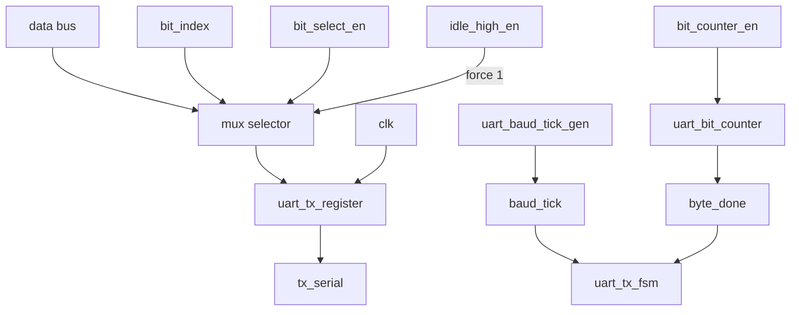
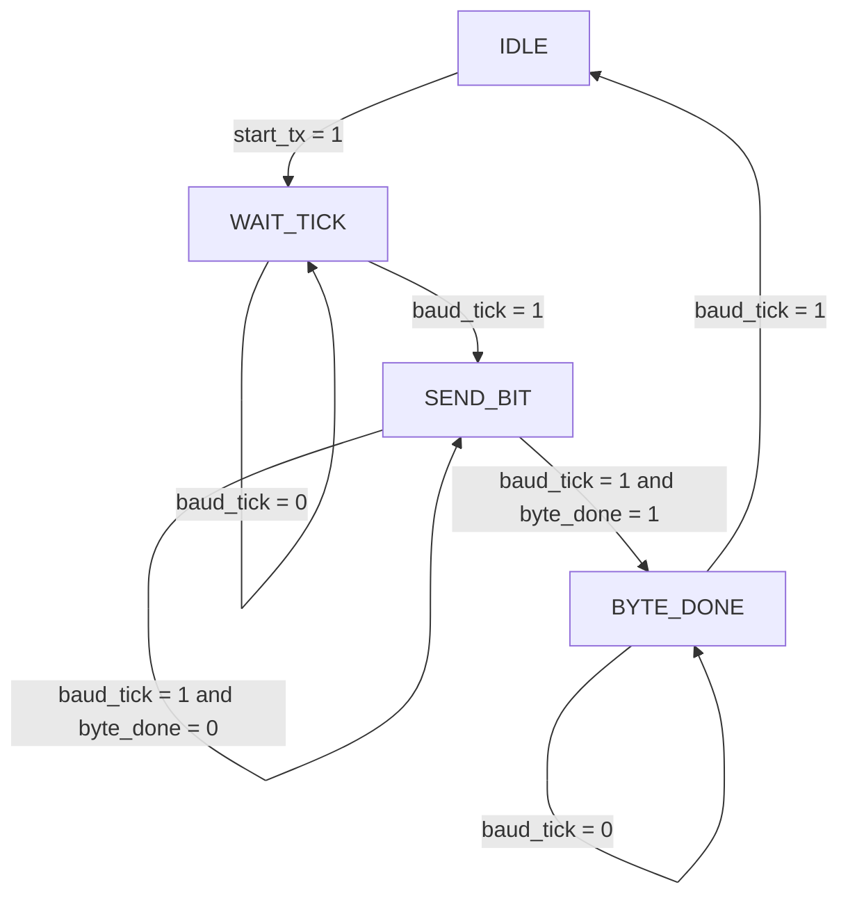

# UART with Datapath and Control Path

## Overview
This project documents a UART transmitter implemented as a hardware
module split into two separate architectural blocks:

- A control path responsible for the finite-state sequencing
- A datapath responsible for selecting the serial bit, counting bits,
  and driving the output signal

The current implementation focuses on the transmitter side. The receiver
is not yet implemented and is planned as a future extension of the
project.

## Project objective
The transmitter receives an 8-bit input word and serializes it into a
UART-like bit stream. The design uses a baud-rate tick signal to control
when each bit is transmitted. A state machine orchestrates when the
module stays idle, advances to transmission, and returns to rest once the
byte has been sent.

## Module organization
| File | Module name | Description |
| --- | --- | --- |
| uart_tx_top.v | uart_tx_top | Top-level UART transmitter wrapper |
| uart_tx_fsm.v | uart_tx_fsm | FSM that decides the transmission sequence |
| uart_tx_datapath.v | uart_tx_datapath | Serial bit selection and output-driving logic |
| uart_baud_tick_gen.v | uart_baud_tick_gen | Baud-rate tick generator |
| uart_bit_counter.v | uart_bit_counter | Byte bit-position counter |
| uart_tx_register.v | uart_tx_register | Register that captures the current serial value |

## Top-level interface
| Signal | Type | Description |
| --- | --- | --- |
| clk | input | Main system clock |
| data_in[7:0] | input | Byte to be transmitted |
| start_tx | input | Start signal that begins the transmission sequence |
| tx_serial | output | Serial UART output line |

## Datapath diagram

The real datapath logic is implemented in `uart_tx_datapath` as:

- `next_tx_bit = (bit_select_en & data_in[bit_index]) | (idle_high_en & 1)`
- `bit_select_en = 1` selects the active bit from the byte
- `idle_high_en = 1` forces logic 1 during idle or completion
- `uart_tx_register` captures the selected value on each clock edge
- `uart_bit_counter` increments `bit_index` only when `bit_counter_en` is asserted
- `byte_done` becomes active when the counter reaches the last bit position

This means the datapath is not just a simple pass-through; it is a mux-controlled bit selector with an idle-high override and a byte-index counter.

## Control path diagram

The FSM implemented in `uart_tx_fsm` follows these output conditions:

- `IDLE`: `bit_select_en = 0`, `idle_high_en = 1`
- `WAIT_TICK`: `bit_select_en = 0`, `idle_high_en = 0`
- `SEND_BIT`: `bit_select_en = 1`, `idle_high_en = 0`, `bit_counter_en = baud_tick`
- `BYTE_DONE`: `bit_select_en = 0`, `idle_high_en = 1`

This exactly matches the code: the datapath is enabled only in `SEND_BIT`, while `IDLE` and `BYTE_DONE` keep the transmitter in a logic-high idle state.

## Functional description
### uart_tx_top
The module `uart_tx_top` is the top wrapper that connects the control and datapath blocks. It receives the input byte and the start signal, and exposes the serial output on `tx_serial`.

### uart_tx_fsm
This module behaves as the transmitter state machine. It transitions between idle, wait, transmit, and completion states, generating the necessary control signals for the datapath.

### uart_tx_datapath
The datapath handles the actual serial transmission. It selects the proper bit from `data_in`, updates the internal counters, and assigns the result to the `tx_serial` output according to the control signals.

### uart_baud_tick_gen
This block generates the baud-rate tick used to time each UART bit. It acts as the periodic timing reference for serializing the data.

### uart_bit_counter
This counter tracks which bit of the byte is being transmitted. When the last bit is reached, it asserts `byte_done` to signal the end of the transmission.

### uart_tx_register
This register stores the current bit output value and updates it on each rising clock edge. It effectively forms the memory element that drives serial data onto the output line.

## Current status and next steps
The project currently implements the transmitter path. The receiver side is still under development and is expected to be added in a future revision. The modular split into control path and datapath is already structured to allow the addition of a complementary receiver block without changing the overall architecture.

## Notes
This design is intended as a clear RTL reference for a datapath/control path UART implementation. It is useful for understanding state-based serial transmission and for extending the project toward a complete full-duplex UART in later stages.
