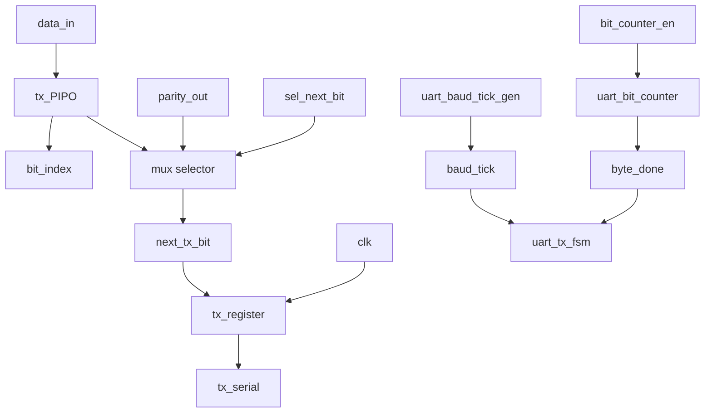
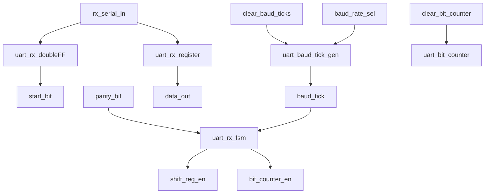
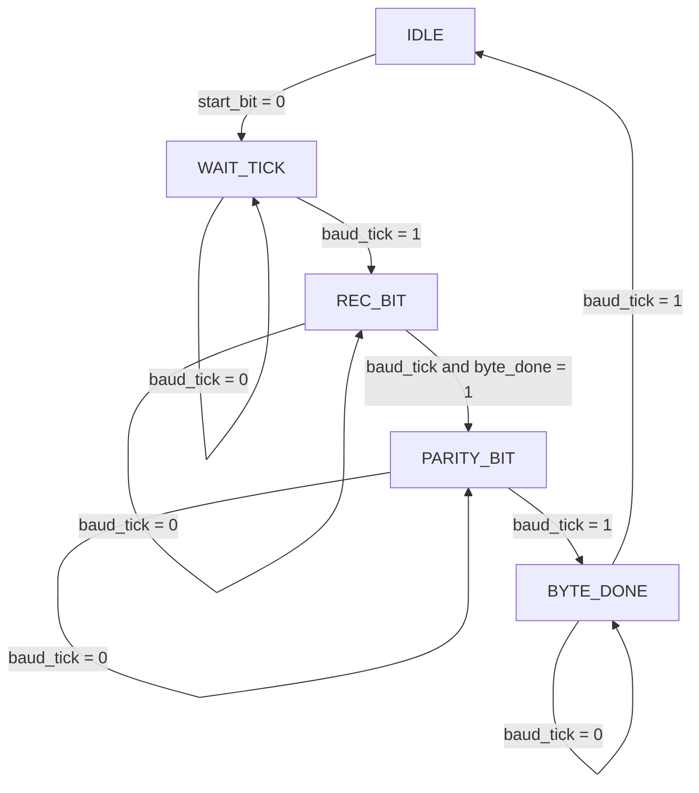

# UART Control and Datapath Core

## Overview
This project documents a UART implementation split into a control path
and a datapath. The current RTL includes a complete transmitter path
and a receiver path under active validation. The design is organized so
that the FSM and the datapath remain separate and readable.

The architecture is based on the following rule:

- control path: state sequencing and signal generation
- datapath: bit selection, shift register behavior, and data routing

## Project objective
The UART core serializes and deserializes 8-bit data using a baud-rate
based timing reference. The transmitter emits a frame with start,
data, parity, and idle/stop phases, while the receiver reconstructs the
bit stream into a byte and marks completion.

## Module organization
| File | Module name | Description |
| --- | --- | --- |
| uart_tx_top.v | uart_tx_top | Top-level UART transmitter wrapper |
| uart_tx_fsm.v | uart_tx_fsm | TX FSM with frame sequencing and parity timing |
| uart_tx_datapath.v | uart_tx_datapath | TX bit selection, mux routing, and parity support |
| uart_tx_register.v | uart_tx_register | Serial register that drives the TX output |
| uart_tx_mux.v | uart_tx_mux | Selector for start/data/parity/idle values |
| uart_tx_PIPO.v | uart_tx_PIPO | Input register used to store the payload during TX |
| uart_baud_tick_gen.v | uart_baud_tick_gen | Baud-rate tick generator with clear support |
| uart_bit_counter.v | uart_bit_counter | Bit counter used for frame progression |
| uart_parity_calculator.v | uart_parity_calculator | XOR-based parity generator |
| uart_rx_top.v | uart_rx_top | Top-level UART receiver wrapper |
| uart_rx_fsm.v | uart_rx_fsm | RX FSM for start-bit detection and sampling |
| uart_rx_datapath.v | uart_rx_datapath | RX synchronization, shift register, and timing path |
| uart_rx_register.v | uart_rx_register | RX shift register for byte reconstruction |
| uart_rx_doubleFF.v | uart_rx_doubleFF | Double flip-flop synchronizer |
| uart_tb.v | uart_tb | Testbench used to exercise TX and RX flow |

## Top-level interfaces

### Transmitter interface
| Signal | Type | Description |
| --- | --- | --- |
| clk | input | System clock |
| data_in | input | 8-bit payload to transmit |
| start_tx | input | Start condition for a new TX frame |
| tx_serial | output | UART TX line |

### Receiver interface
| Signal | Type | Description |
| --- | --- | --- |
| clk | input | System clock |
| data_in | input | Incoming serial line |
| data_out | output | Reconstructed RX byte |
| done | output | Marks completion of the received byte |

## Transmitter datapath

The TX datapath is implemented in uart_tx_datapath. It performs the
following operations:

- stores the input byte in a temporary register
- selects the correct bit or control value with the TX mux
- calculates parity for the frame
- drives the serial output through uart_tx_register
- advances the bit counter when enabled by the FSM

The selected values are controlled by sel_next_bit and follow the frame
sequence: idle, start, data, parity, and stop behavior.

## Transmitter control path

The TX FSM in uart_tx_fsm controls the following phases:

- IDLE: waits for a valid start_tx request
- WAIT_TICK: waits for the baud timing reference
- SEND_BIT: transmits the serial payload bits
- PARITY_BIT: sends the parity bit
- BYTE_DONE: returns to idle after the frame completes

The FSM also drives control signals such as:

- reg_input to load the payload into the transmitter register
- sel_next_bit to choose the active source for the serializer
- bit_counter_en to advance the bit count
- clear_baud_ticks and clear_bit_counter for reset purposes

## Receiver datapath

The RX datapath is implemented in uart_rx_datapath. It performs the
following operations:

- synchronizes the incoming serial signal
- detects the start condition
- shifts incoming bits into the receive register
- generates baud timing for sampling
- tracks the bit index and completion state
- calculates the parity bit associated with the received payload

## Receiver control path

The RX FSM in uart_rx_fsm controls the sequencing of the receive path:

- IDLE: waits for the incoming start bit
- WAIT_TICK: waits for the sample timing reference
- REC_BIT: captures each bit and advances the counter
- PARITY_BIT: validates or processes the parity field
- BYTE_DONE: marks the end of the receive cycle and asserts done

## Functional description
### uart_tx_top
The top-level transmitter module instantiates the TX FSM and TX datapath,
then exposes the serial output to the external interface.

### uart_tx_fsm
This FSM controls the UART frame sequence. It decides when the line is
idle, when to begin a transmission, when to sample data, and when the
parity phase and finalization occur.

### uart_tx_datapath
This module handles the routing of the Tx frame source, updates the
output register, and prepares the serial word for transmission.

### uart_tx_mux
This block selects the next value to drive onto the serial line:
idle, start, data, or parity, depending on the FSM state.

### uart_tx_PIPO
This register stores the current payload so it can be serialized safely
while the FSM advances through the frame.

### uart_baud_tick_gen
This block generates the baud-rate tick used by the UART. It includes a
clear signal so the timing counter can be reset when a new frame starts.

### uart_bit_counter
This block counts the active bits within a frame and asserts byte_done
when the count reaches the terminal condition.

### uart_parity_calculator
This module computes the parity bit using the XOR reduction of the input
byte.

### uart_tx_register
This register captures the currently selected serial value and forwards
it to the UART output line on each clock edge.

### uart_rx_top
This is the receiver wrapper. It integrates the receive FSM and the
receive datapath, then exposes the reconstructed byte and done flag.

### uart_rx_fsm
This FSM manages detection of the start condition, frame sampling,
parity handling, and end-of-byte detection.

### uart_rx_datapath
This datapath synchronizes the RX input, shifts the bit stream into a
register, generates timing ticks, and reconstructs the final byte.

### uart_rx_register
This module shifts each sampled bit into a byte-format result register.

### uart_rx_doubleFF
This module synchronizes the external RX signal before it is used by the
rest of the receiver logic.

### uart_tb
This testbench exercises the transmitter and receiver connection in one
simulation environment. It is intended to validate frame timing,
completion signaling, and the reconstruction of the serial payload.

## Current project status
The UART design is currently in a structured RTL development stage. The
transmitter path is well organized and the receiver path is present and
connected to the same control/datapath architecture. The project is now
focused on validating the complete frame flow, including parity handling,
baud timing, and state transitions.

The next logical steps are:

- validate the frame ordering between TX and RX
- verify parity generation and RX parity handling
- confirm bit counter timing across the complete frame
- improve testbench assertions for end-to-end UART validation

## Notes
The repository is intended as a clear RTL reference for a UART designed
using a datapath/control-path split. This structure helps to reason
about the frame sequence, timing decisions, and the hardware flow of the
serial protocol.
